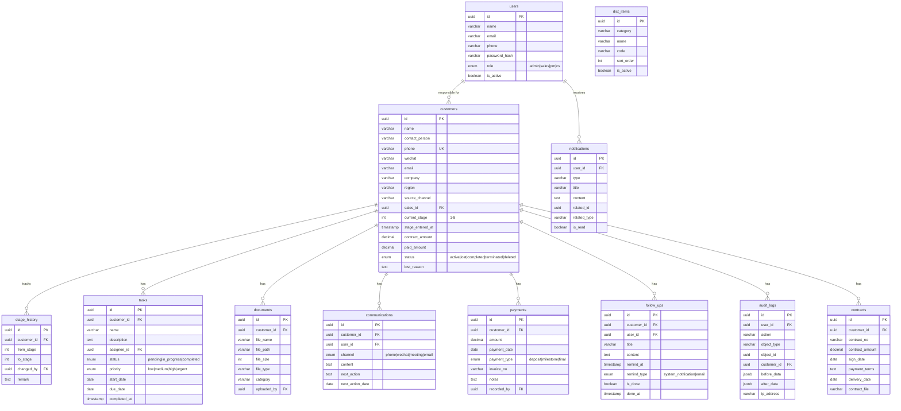

# CRM System

A full-stack Customer Relationship Management (CRM) system featuring an 8-stage Kanban workflow for managing customer pipelines from lead generation through project completion. Built with Vue 3 and FastAPI, the system provides comprehensive tools for customer management, contract handling, task tracking, document storage, communication logging, payment processing, and team collaboration.

## Features

- **Authentication & Authorization**: JWT-based login with role-based access control (Admin, Sales, PM, CS)
- **Kanban Board**: Drag-and-drop 8-stage workflow with visual alerts for overdue items
- **Customer Management**: Full CRUD with stage advancement, status tracking, and sales assignment
- **Customer Detail Page**: 6-tab interface (Basic Info, Contracts, Tasks, Communications, Payments, Documents) with timeline view
- **Contract Management**: Create, update, and manage customer contracts with sign-date tracking
- **Task Management**: Per-customer tasks with assignee, priority, status, and due dates
- **Document Upload/Download**: File management with support for MinIO (S3-compatible) and local filesystem fallback
- **Communication Records**: Log all customer interactions with type classification
- **Payment Management**: Track payments, amounts, and collection rates
- **Dashboard & Statistics**: Overview stats, funnel analysis, sales workload distribution, and payment trends
- **Global Search**: Search customers by name, contact person, phone, company, and other fields
- **Notifications**: In-app notification system with unread count and read status
- **Follow-up Reminders**: Schedule and track customer follow-ups with status tracking
- **Batch Operations**: Batch assign sales, update status, and delete customers
- **Excel Import/Export**: Import customers from Excel files and export filtered data
- **Audit Logs**: Complete operation history with data snapshots for full traceability
- **Data Dictionary**: Dynamic configuration of dropdown options (industries, regions, channels, categories)
- **User Management**: Full user CRUD with role assignment and password management
- **Profile Settings**: Personal information and password change

## Tech Stack

| Layer | Technology |
|-------|-----------|
| Frontend | Vue 3, Element Plus, Pinia, Vue Router, Axios, Vite |
| Backend | FastAPI, SQLAlchemy 2.0, Pydantic, JWT |
| Database | MySQL 8.0 (utf8mb4) |
| Cache | Redis 7 |
| File Storage | MinIO (S3-compatible) / Local filesystem fallback |
| Deployment | Docker Compose |

## Project Structure

```
backend/
├── app/
│   ├── main.py              # FastAPI application entry point
│   ├── config.py             # Application configuration (Pydantic Settings)
│   ├── database.py           # Database connection setup
│   ├── models/               # SQLAlchemy models (12 tables)
│   ├── schemas/              # Pydantic validation schemas
│   ├── api/                  # REST API routes (15 modules)
│   ├── services/             # Business logic layer
│   └── core/                 # JWT authentication & dependency injection
├── alembic/                  # Database migration scripts
├── requirements.txt
├── Dockerfile
├── .flake8
└── pyproject.toml

frontend/
├── src/
│   ├── views/                # Page components (12 pages)
│   ├── components/           # Shared components (6)
│   ├── stores/               # Pinia state stores (3)
│   ├── api/                  # API client & request configuration
│   ├── router/               # Route definitions & navigation guards
│   └── styles/               # Global CSS & design variables
├── nginx.conf                # Nginx reverse proxy config
├── Dockerfile
└── package.json

docker-compose.yml             # 5-service orchestration
.env.example                   # Environment variable template
```

## Quick Start (Docker - recommended)

Requires Docker Desktop with Docker Compose.

```bash
# 1. Clone and enter project
cd 实习任务week1

# 2. Configure environment
#    A ready-to-use .env is already included for the demo (works out of the box).
#    For production, regenerate it:  cp .env.example .env
#    Then edit .env: set DB_PASSWORD, MINIO_USER, MINIO_PASSWORD and a long random JWT_SECRET

# 3. Start all services (MySQL + Redis + MinIO + backend + frontend)
docker-compose up -d --build

# 4. Tables are created automatically on backend startup (SQLAlchemy create_all) - no manual migration needed.
#    Load demo data (35 customers, dictionaries and sample business records):
docker-compose exec backend python -m app.scripts.seed_demo

# 5. Open http://localhost and log in with one of the demo accounts below.
```

### Demo accounts (created by the seed script, password: demo123456)

| Role  | Email                |
|-------|----------------------|
| Admin | demo.admin@crm.com   |
| Sales | zhangwei@crm.com     |
| Sales | lina@crm.com         |
| Sales | wangfang@crm.com     |
| PM    | chenjie@crm.com      |
| CS    | liuyang@crm.com      |

After starting, access:

- Frontend: http://localhost
- API Docs (Swagger): http://localhost:8000/docs
- API Docs (ReDoc): http://localhost:8000/redoc
- MinIO Console: http://localhost:9001

Without Docker? Follow [Run locally without Docker](#run-locally-without-docker-windows) below.

## API Documentation

Once the server is running, full API documentation is automatically generated and available at:

- **Swagger UI**: http://localhost:8000/docs — interactive API explorer
- **ReDoc**: http://localhost:8000/redoc — read-only reference documentation

## API Endpoints Overview

| Category | Endpoints | Description |
|----------|-----------|-------------|
| Auth | `POST /api/v1/auth/login`, `POST /api/v1/auth/refresh`, `GET /api/v1/auth/me` | Login, token refresh, current user |
| Customers | `POST/GET/PUT/DELETE /api/v1/customers`, `PUT .../stage`, `PUT .../status`, `PUT .../assign`, `GET .../timeline` | Full customer management |
| Contracts | `POST/GET/PUT/DELETE /api/v1/customers/{id}/contract` | Contract CRUD per customer |
| Tasks | `POST/GET/PUT/PATCH/DELETE /api/v1/customers/{id}/tasks` | Task management per customer |
| Documents | `POST/GET/PUT/DELETE /api/v1/customers/{id}/documents` | Document upload/download per customer |
| Communications | `POST/GET/PUT/DELETE /api/v1/customers/{id}/communications` | Communication records per customer |
| Payments | `POST/GET/PUT/DELETE /api/v1/customers/{id}/payments` | Payment records per customer |
| Board | `GET /api/v1/board/kanban`, `GET /api/v1/board/alerts` | Kanban data & overdue alerts |
| Dashboard | `GET /api/v1/dashboard/stats`, `/funnel`, `/sales`, `/payments` | Statistics & analytics |
| Users | `POST/GET/PUT /api/v1/users`, `PUT .../password` | User management |
| Notifications | `GET /api/v1/notifications`, `PUT .../{id}/read` | In-app notifications |
| Follow-ups | `POST/GET/PUT/DELETE /api/v1/customers/{id}/follow-ups` | Follow-up reminders |
| Audit Logs | `GET /api/v1/audit-logs` | Operation history logs |
| Data Dictionary | `GET /api/v1/dict/{type}`, `PUT /api/v1/dict/{id}` | Dictionary management |
| Search | `GET /api/v1/search/global` | Global customer search |

## Kanban Stage Flow

| Stage | Normal Stay | Alert Line | Description |
|-------|------------|------------|-------------|
| 1 — Lead | 7 days | 14 days | New customer, initial contact |
| 2 — Consult | 14 days | 21 days | In-depth communication and needs analysis |
| 3 — Contract | 7 days | 14 days | Contract signing and deposit collection |
| 4 — Requirements | 14 days | 21 days | Detailed requirement analysis and specification |
| 5 — Service Execution | 30 days | 45 days | Project development and implementation |
| 6 — Delivery | 14 days | 21 days | Customer acceptance and delivery |
| 7 — Payment | 30 days | 45 days | Payment collection and invoicing |
| 8 — Completed | — | — | Process complete, customer archived |

The system enforces sequential stage advancement with prerequisite checks:
- Stage 2→3: Requires at least one signed contract
- Stage 5→6: Requires all tasks completed
- Stage 6→7: Requires customer acceptance documents uploaded
- Stage 7→8: Requires full payment (paid amount ≥ contract amount)

## Database ER Diagram

The CRM system uses MySQL and contains 12 main tables:



## Roles & Permissions

| Module | Admin | Sales | PM | CS |
|--------|-------|-------|-----|-----|
| Customer Info | All | Own | — | — |
| Contracts | All | Read-only | — | — |
| Tasks | All | Read-only | Assigned | — |
| Communications | All | Own | Assigned | Assigned |
| Payments | All | Read-only | — | — |
| Documents | All | Read-only | Assigned | Read-only |
| Stage Advance | All | Own | — | — |
| Batch Operations | Yes | — | — | — |

## Color Scheme

| Stage | Color | Background |
|-------|-------|------------|
| 1 — Lead | `#909399` | `#f4f4f5` |
| 2 — Consult | `#409EFF` | `#ecf5ff` |
| 3 — Contract | `#36CFC9` | `#e6fffb` |
| 4 — Requirements | `#E6A23C` | `#fdf6ec` |
| 5 — Service Execution | `#722ED1` | `#f9f0ff` |
| 6 — Delivery | `#67C23A` | `#f0f9eb` |
| 7 — Payment | `#2F54EB` | `#f0f5ff` |
| 8 — Completed | `#389E0D` | `#f6ffed` |

Alert colors: Normal `#52C41A`, Warning `#FAAD14`, Danger `#FF4D4F`

## Run locally without Docker (Windows)

The project bundles a Python venv (`.venv`) and a portable Node.js (`.nodejs`)
with all dependencies, so on a delivered machine only **MySQL** needs to be
installed. The steps below also work if you build the environment from scratch.

### 1. Prerequisites

- MySQL 8 running on the machine (local or remote)
- Python 3.10+ — only needed if `.venv` is not bundled
- Node.js 18+ — only needed if `.nodejs` is not bundled

### 2. Initialize the database

Tables are created automatically on backend startup. You only need to create
the database and application user once:

```bash
mysql -uroot -p < db_init.sql
```

### 3. Configure the backend

```bash
cd backend
copy .env.example .env      # Windows
# cp .env.example .env      # Linux/macOS
```

Edit `backend/.env`: make `DATABASE_URL` match your MySQL setup and replace
`JWT_SECRET` with a long random string
(`python -c "import secrets; print(secrets.token_hex(32))"`).

### 4. Create tables and load demo data

```bash
cd backend
# Create all tables (same command the app runs on startup)
.venv\Scripts\python -c "from app.database import Base, engine; import app.models; Base.metadata.create_all(bind=engine)"
# Load demo data (idempotent - safe to re-run)
.venv\Scripts\python -m app.scripts.seed_demo
```

> `start-all.bat` runs both steps automatically on the first start
> (when the `users` table is empty), so steps 4 can be skipped if you
> launch via `start-all.bat`.

If `.venv` is missing, create it first:

```bash
cd backend
python -m venv .venv
.venv\Scripts\pip install -r requirements.txt
```

### 5. Start everything (one click)

Double-click **`start-all.bat`** at the project root. It:

- verifies Python / Node / MySQL connectivity,
- installs frontend dependencies if missing,
- opens the backend (http://127.0.0.1:8000/docs) and the frontend
  (http://localhost:5173) in two windows.

Or start manually:

```bash
# Terminal 1 - backend
cd backend
.venv\Scripts\python -m uvicorn app.main:app --host 127.0.0.1 --port 8000

# Terminal 2 - frontend
cd frontend
set PATH=%PATH%;..\.nodejs\node-v20.19.4-win-x64   # only if using bundled Node.js
npm install   # only the first time
npm run dev
```

The frontend dev server runs on port 5173 and automatically proxies `/api`
requests to `http://localhost:8000`.

> If Python/Node are not bundled in your delivery, replace `.venv\Scripts\python`
> with your system `python` and use your system `npm` instead of the bundled one.
> Redis and MinIO are optional — the app degrades gracefully when they are absent.

## Code Quality

This project uses:

- **ESLint** — JavaScript/Vue linting (`frontend/.eslintrc.cjs`)
- **Black** — Python code formatter (`backend/pyproject.toml`)
- **Flake8** — Python linter (`backend/.flake8`)

### Run linting

```bash
# Frontend
cd frontend && npx eslint src/

# Backend
cd backend && black --check app/
flake8 app/
```

## FAQ / Troubleshooting

- **Backend crashes with a MySQL connection error**: MySQL is not running, or
  `backend/.env` → `DATABASE_URL` does not match your MySQL. Verify that
  `db_init.sql` was executed and the credentials are correct.
- **Frontend shows 401 on the login page**: expected — the API requires a token.
  Log in with a demo account.
- **`cryptography` warning during install**: harmless for local development.
- **Port already in use (8000 / 5173)**: a previous instance is still running;
  stop it first (e.g. `taskkill /F /PID <pid>`), then start again.
- **Where are uploaded files stored?**: under `backend/app/uploads/` by default.
  MinIO is used only when `MINIO_*` settings are configured.
- **Re-running the demo seed**: `python -m app.scripts.seed_demo` is idempotent —
  it skips safely when demo data already exists.
- **Can new users sign up?**: yes — the login page has a registration form.
  Registered users get the `sales` role and can be upgraded by an admin.
- **Is the system production-safe out of the box?**: change `JWT_SECRET` in
  `.env` before going live (a weak default would otherwise be used), use a
  strong MySQL password, and keep `backend/.env` out of version control
  (it is already git-ignored).
